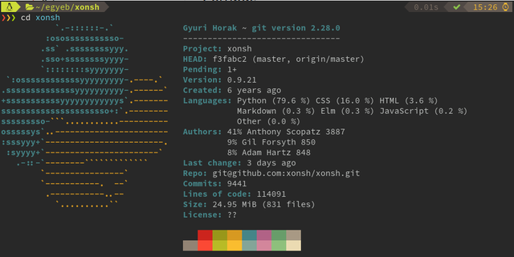

# xontrib-gitinfo

Displays git information on entering a repository folder.
Uses [onefetch](https://github.com/o2sh/onefetch) if available.



## Requirements

- Python 3.7+ (might work with older version as well)
- [xonsh](https://xon.sh/)
- [optional] [onefetch](https://github.com/o2sh/onefetch)

## Install

```
$ pip install xontrib-gitinfo
$ xontrib load gitinfo
```

## Logo

If an image called `logo.png` exists in the repository root then it is used by `onefetch`.
